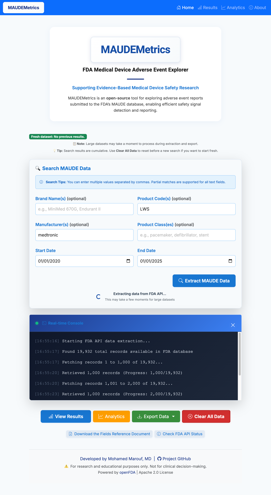

# MAUDEMetrics

[](LICENSE)
[](https://www.python.org/)
[](https://www.docker.com/)

## Introduction

**MAUDEMetrics** is a user-friendly tool for analyzing and reporting on medical device events using data from the FDA's Manufacturer and User Facility Device Experience (MAUDE) Database via the openFDA API.  
It enables clinicians, researchers, and quality teams to quickly fetch, explore, and export device event data for further analysis.

> ⚠️ **Disclaimer:** This tool is for research and educational purposes only. Not for clinical decision-making.

---

## GitHub Repository

[https://github.com/MohamedMaroufMD/MAUDEMetrics](https://github.com/MohamedMaroufMD/MAUDEMetrics)

---

## Table of Contents

- [Features](#features)
- [Screenshots](#screenshots)
- [Quick Start](#quick-start)
- [Installation & Usage](#installation--usage)
- [Export & Reports](#export--reports)
- [API Details](#api-details)
- [FAQ / Troubleshooting](#faq--troubleshooting)
- [Contributing](#contributing)
- [License](#license)
- [Acknowledgments](#acknowledgments)
- [Contact](#contact)

---

## Features

### 🔍 Advanced Search Capabilities
- **Brand Name Search:** Partial matching with case-insensitive search
- **Product Code Search:** FDA product codes (e.g., MAF, KYF, MND)
- **Manufacturer Search:** Company names with flexible matching
- **Device Type Search:** Generic device names (e.g., pacemaker, stent)
- **Date Range Filtering:** Flexible start/end date selection
- **Multiple Values:** Separate multiple entries with commas
- **Cumulative Results:** Build comprehensive datasets across searches

### 📊 Analytics Dashboard
- **Event Type Analysis:** Distribution of adverse events
- **Patient Demographics:** Age, sex, ethnicity, and race breakdowns
- **Manufacturer Analysis:** Top manufacturers and countries
- **Device Type Analysis:** Most common device types
- **Product Problem Analysis:** Categorized device issues
- **Interactive Chart:** Visualize event types per brand name with modern multi-select filters (checkboxes and search) for Brand Name and Event Type, powered by Choices.js

### 📈 Data Export & Reporting
- **Multi-Sheet Export:** Professional formatting with multiple sheets
- **Raw Events Sheet:** Complete event data for analysis
- **MDR Texts Sheet:** Narrative reports and problem descriptions
- **Custom Events Sheet:** Processed data with consistent formatting
- **Summary Sheet:** Patient demographics and event summaries

### 🎨 Modern User Interface
- **Responsive Design:** Works on desktop, tablet, and mobile
- **Bootstrap 5 Framework:** Modern, accessible UI components
- **Micro-interactions:** Subtle hover effects and animations
- **Intuitive Navigation:** Clear, consistent user experience
- **Professional Styling:** Clean, medical-grade interface
- **Modern Multi-Select Filters:** Interactive dropdowns with checkboxes and search (Choices.js) for analytics filtering

### 🔧 Technical Features
- **Flask Backend:** Python-based web framework
- **SQLite Database:** Local data storage and caching
- **openFDA API Integration:** Direct FDA data access
- **Pandas Processing:** Advanced data manipulation
- **Excel Export:** Professional report generation
- **Docker Support:** Easy deployment and containerization
- **Modern Multi-Select Filters:** Analytics dashboard uses Choices.js for user-friendly filtering by brand and event type

---

## Screenshots

> _See the [GitHub repository](https://github.com/MohamedMaroufMD/MAUDEMetrics) for screenshots and sample exported files!_
> 
> _The analytics dashboard now features an interactive chart with modern multi-select filters (checkboxes and search) for Brand Name and Event Type._



---

## Quick Start

```bash
# 1. Clone the repository
git clone https://github.com/MohamedMaroufMD/MAUDEMetrics.git
cd MAUDEMetrics

# 2. Build and run with Docker
docker-compose up --build

# 3. Open your browser
open http://localhost:5005
```

---

## Installation & Usage

### Prerequisites

- [Docker](https://www.docker.com/get-started) installed
- (Optional) Python 3.8+ if running locally

### Manual Setup (without Docker)

```bash
pip3 install -r requirements.txt
python3 app.py
```

Then visit [http://localhost:5005](http://localhost:5005) in your browser.

### Usage

1. **Search Setup:** Enter search criteria in any combination:
   - **Brand Name(s):** e.g., "MiniMed 670G, Endurant II"
   - **Product Code(s):** e.g., "MAF, KYF, MND"
   - **Manufacturer:** e.g., "Medtronic, Abbott"
   - **Type of Device:** e.g., "pacemaker, defibrillator, stent"
   - **Date Range:** Select start and end dates

2. **Execute Search:** Click **Extract MAUDE Data**

3. **Review Results:** View recent events (last 50) in the browser or export for analysis

4. **Export Data:** Click **Export Data** for professional .xlsx (Excel-compatible) reports

---

## Export & Reports

### Export Features
- **Raw_Events Sheet:** Complete event data with all FDA fields
- **MDR_Texts Sheet:** Narrative reports and problem descriptions
- **Custom_Events Sheet:** Processed data with consistent formatting
- **Summary Sheet:** Patient demographics, event types, and product problems

### Data Formatting
- **Consistent Date Format:** All dates formatted as mm/dd/yyyy
- **Professional Styling:** Clean, readable .xlsx formatting
- **Multiple Sheets:** Organized data presentation
- **Data Validation:** Ensures data integrity and compatibility

---

## API Details

This application interacts with the [openFDA API](https://open.fda.gov/apis/device/event/).  
See the [fields reference](https://open.fda.gov/fields/deviceevent_reference.xlsx) for available data fields.

### Search Query Building
- **Flexible Matching:** Case-insensitive partial matching
- **Multiple Terms:** Support for comma-separated values
- **Wildcard Support:** Automatic wildcard expansion for partial matches
- **Date Range Filtering:** Precise date-based filtering

---

## FAQ / Troubleshooting

**Q: Docker won't start or port is in use?**  
A: Make sure port 5005 is free, or change the port in `docker-compose.yml`.

**Q: The export is empty or missing data?**  
A: Ensure you have run a search and that the FDA API is available.

**Q: How do I reset the database?**  
A: Use the "Clear All Data" button in the UI.

**Q: Can I search for multiple manufacturers at once?**  
A: Yes, separate multiple manufacturers with commas (e.g., "Medtronic, Abbott").

**Q: Are search results case-sensitive?**  
A: No, all searches are case-insensitive with partial matching.

**Q: How are dates formatted in exports?**  
A: All dates are consistently formatted as mm/dd/yyyy across all sheets.

---

## Contributing

Contributions are welcome!  
Please fork the repository and submit a pull request.

### Development Setup
```bash
git clone https://github.com/MohamedMaroufMD/MAUDEMetrics.git
cd MAUDEMetrics
pip install -r requirements.txt
python app.py
```

---

## License

- This project is licensed under the Apache License 2.0. See the [LICENSE](LICENSE) file for details.

---

## Acknowledgments

- [openFDA API](https://open.fda.gov/) for device event data
- [Flask](https://flask.palletsprojects.com/) community for documentation and support
- [Bootstrap](https://getbootstrap.com/) for modern UI components
- [Pandas](https://pandas.pydata.org/) for data processing capabilities

---

## Contact

For questions, suggestions, or support, please [open an issue](https://github.com/MohamedMaroufMD/MAUDEMetrics/issues) on GitHub.

